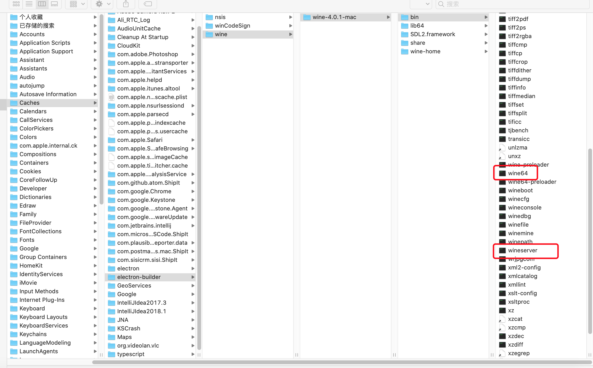

### macOS 15版本无法打包win32系统
> mac电脑升级系统版本后就无法打包win32位，打包失败，或者中间弹出苹果系统提醒的弹框导致无法打包，下面就根据自身的经历给大家做解决意见。

1、升级electron-builder版本到22.4.1

2、升级完成后，开始进行安装，electron-builder会下载相应版本的依赖包，下载会很慢一般手动安装

3、手动安装完成后，继续build，中间苹果系统会提示发现恶意软件的警告弹框，点击取消。
根据下图找到wine64和wineserver，用终端打开

4、然后继续build，就成功